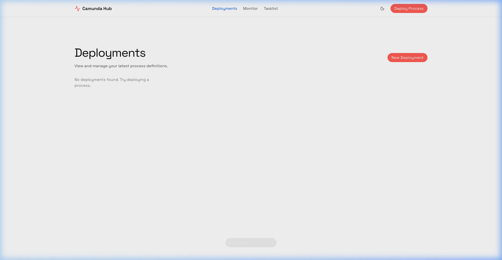
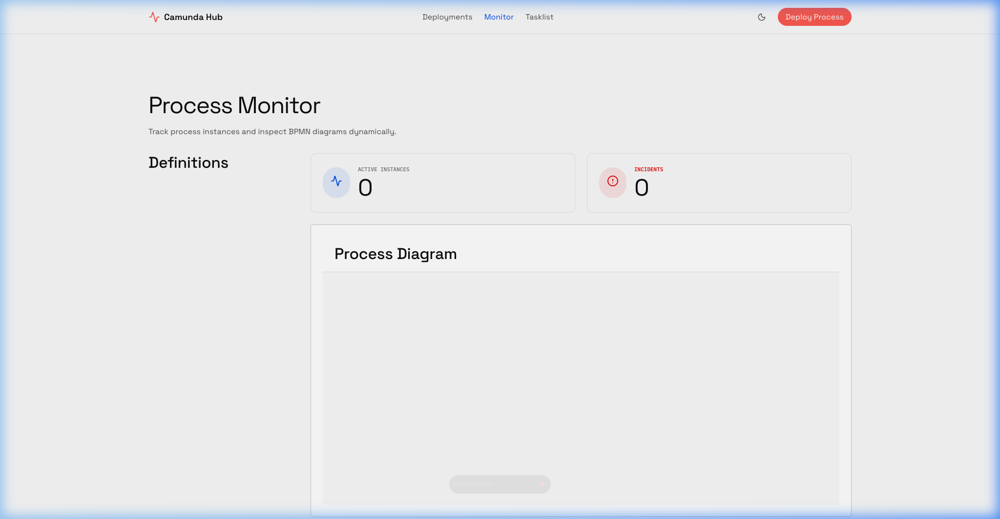
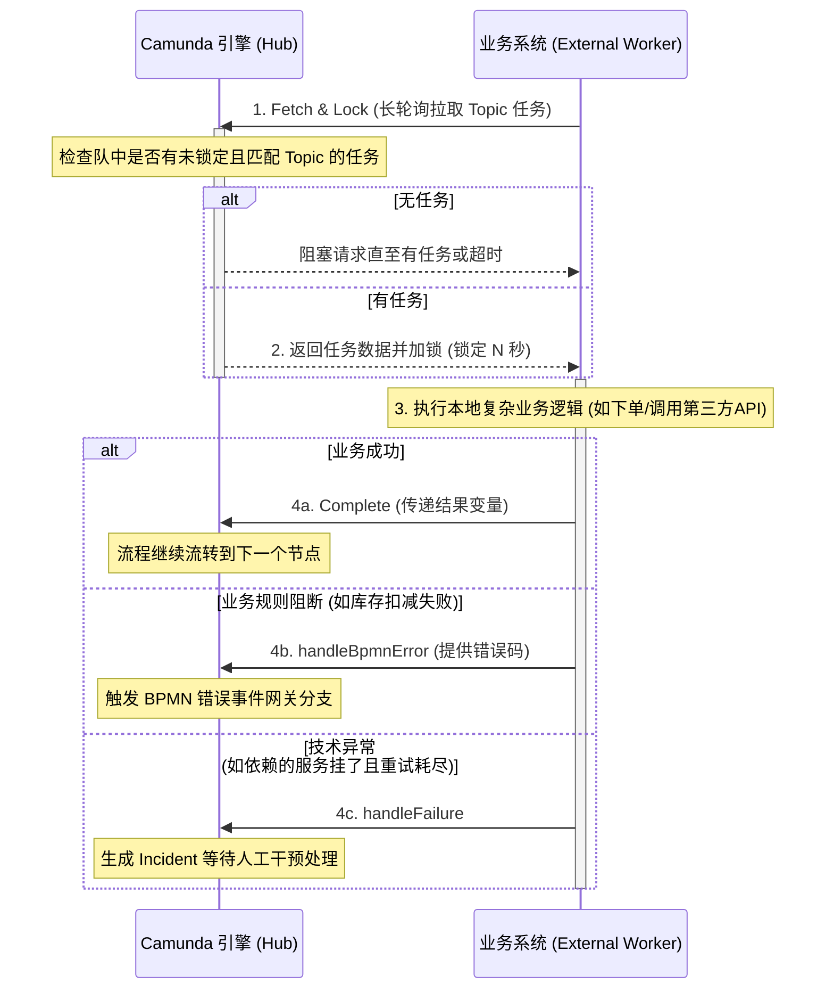

# Camunda 7 中心化工作流服务

基于 **Camunda 7.20** + **Spring Boot 2.7.x** 构建的中心化工作流引擎（Workflow Hub）。

引擎仅负责**流程状态维护和路由**，业务逻辑通过两种模式委托给业务子系统执行：

| 模式 | 说明 | 适合场景 |
|------|------|----------|
| 模式一：HTTP 回调 (Webhook) | 引擎主动 POST 调用业务接口 | 调用方无法引入 Camunda SDK |
| 模式二：外部任务 (External Task) | 业务服务轮询拉取任务（官方推荐） | 微服务架构，解耦强，可靠性高 |

---

## 产品效果呈现

全新构建了独立的高级前端控制台，提供极佳的监控体验与现代化的界面。

### 1. 引擎管理概览
全面监控引擎整体健康度、相关流程实例以及系统核心指引等。


### 2. 功能中心与操作台
包含流程定义、实例监控、人工审批等模块的统一交互体验。


---

## 项目结构

```
camunda_service/
├── src/main/java/com/example/workflow/
│   ├── CamundaWorkflowApplication.java   # 入口（@EnableProcessApplication）
│   ├── config/
│   │   └── AppConfig.java               # RestTemplate Bean
│   ├── delegate/
│   │   └── HttpCallbackDelegate.java    # 通用 HTTP 回调委托（模式一）
│   ├── service/
│   │   └── WorkflowService.java         # 引擎操作封装（启动/完成/查询等）
│   ├── controller/
│   │   └── WorkflowController.java      # REST API（对业务线开放）
│   └── worker/
│       └── OrderProcessWorker.java      # 外部任务 Worker 参考示例（模式二）
├── src/main/resources/
│   ├── application.yml                  # 应用配置（支持环境变量覆盖）
│   └── processes/
│       └── order-process.bpmn           # 演示流程（含两种任务模式 + 网关）
├── Dockerfile                           # 多阶段构建（构建 + 运行分离）
├── docker-compose.yml                   # PostgreSQL + 工作流引擎编排
├── .env.example                         # 环境变量模板
└── pom.xml                              # Maven 依赖（Camunda 7.20 BOM）
```

---

## 快速启动

### 1. 配置环境变量

```bash
cp .env.example .env
# 根据实际情况编辑 .env（数据库密码、管理员账号等）
```

### 2. 一键启动（Docker Compose）

```bash
# 打包应用（跳过测试）
mvn clean package -DskipTests

# 构建镜像并启动所有服务（PostgreSQL + 工作流引擎）
docker-compose up -d --build
```

### 3. 验证服务

```bash
# 查看引擎日志
docker-compose logs -f camunda-workflow

# 健康检查（应返回 "status":"UP"）
curl http://localhost:8080/actuator/health
```

**Cockpit 控制台：** <http://localhost:8080/camunda/app/cockpit/default/>
> 账号/密码：`admin / admin`（可在 `.env` 中修改）

---

## REST API 快速参考

> 基础路径：`http://localhost:8080/api/workflow`

### 发起流程

```bash
curl -X POST "http://localhost:8080/api/workflow/start/order-process?businessKey=ORD-001" \
  -H "Content-Type: application/json" \
  -d '{
    "callbackUrl": "http://your-service/api/callback",
    "orderId": "ORD-001",
    "reviewer": "zhangsan"
  }'
```

### 完成人工任务

```bash
# 先查询当前任务
curl "http://localhost:8080/api/workflow/task/by-business?processKey=order-process&businessKey=ORD-001"

# 完成任务（审批通过）
curl -X POST "http://localhost:8080/api/workflow/task/{taskId}/complete" \
  -H "Content-Type: application/json" \
  -d '{"approved": true, "comment": "同意"}'
```

### 发送消息（回调确认）

```bash
curl -X POST "http://localhost:8080/api/workflow/instance/{instanceId}/message?messageName=OrderConfirmed" \
  -H "Content-Type: application/json" \
  -d '{"result": "SUCCESS"}'
```

---

## 外部任务 (External Task) 模式详解

### 1. 核心原理与交互时序

External Task 遵循 **“拉取 (Pull)”** 而非 “推送 (Push)” 的设计哲学，是微服务架构下处理长耗时、高并发任务的最佳实践，也是 Camunda 官方重点推荐的模式（在 Camunda 8 中这更是成为了唯一受支持的服务调用模式）。

* **完全解耦：** 流程引擎不需要知道业务系统的具体地址、IP 或协议（如 REST/gRPC）。引擎只负责持久化状态并发布任务到特定 Topic。
* **长轮询 (Long Polling)：** Worker 为了获取任务会向引擎发送请求。如果当前没有可用任务，引擎会挂起该 HTTP 请求直到有新任务产生（或达到超时时间）。这种机制既避免了传统短轮询造成的空转 CPU 和网络浪费，又保证了任务被触发时的低延迟。
* **获取与锁定 (Fetch & Lock)：** Worker 获取任务时会声明锁定时间（Lock Duration）。在该时间段内，该任务专属于当前 Worker，其他并发拉取的请求由于没有锁无法获取该任务，保证了分布式环境下的执行原子性。
* **状态反馈机制：** Worker 处理结束后，主动向引擎报告结果，这是推动流程继续执行的关键：
  * `Complete`: 成功，可带回计算好的结果变量供下游节点使用。
  * `BpmnError`: 业务层面的未通过或异常（如余额不足），可由 BPMN 图上的边界错误事件（Boundary Error Event）捕获并进入预设的补偿分支。
  * `Failure`: 技术层面的异常（如数据库宕机、第三方接口超时），导致引擎记录重试次数；若重试耗尽，则会抛出运维事件 (Incident)，转由人工介入处理（可通过 Cockpit 重置或跳过）。

**交互时序图：**



### 2. 详细使用步骤与最佳实践

#### 第一步：BPMN 建模配置

1. 在 Camunda Modeler 中选中 **Service Task**。
2. 在属性面板的 **Implementation** 选项选择 `External`。
3. 在 **Topic** 栏填写具有业务意义的唯一标识，例如 `inventory-check`。

#### 第二步：引入客户端依赖（业务系统端）

在你的独立 Spring Boot 微服务项目中添加官方封装的 SDK（引擎所在项目不需改动）：

```xml
<dependency>
    <groupId>org.camunda.bpm</groupId>
    <artifactId>camunda-external-task-client-spring-boot</artifactId>
    <version>7.20.0</version>
</dependency>
```

#### 第三步：客户端属性配置

在业务服务的 `application.yml` 中配置连接参数和调优选项：

```yaml
camunda.bpm.client:
  base-url: http://camunda-workflow:8080/engine-rest  # 中心化引擎的 REST API 基础地址
  async-response-timeout: 20000                      # 长轮询挂起超时时间（建议默认 20s）
  disable-backoff-strategy: false                    # 启用退避策略（空闲时逐渐增加轮询间隔，减轻引擎压力）
  worker-id: inventory-service-${random.uuid}        # Worker 身份标识，在负载均衡集群中便于追踪是哪个实例执行的
  subscriptions:
    inventory-check:                                 # 订阅的 Topic 名称
      variable-names: [orderId, count]               # 【最佳实践】：仅提取需要的变量，避免拉取大数据集导致网络瓶颈
      lock-duration: 30000                           # 锁定时间（毫秒），应略大于你的【最大业务处理耗时】
```

#### 第四步：编写业务逻辑 (Worker)

此段代码运行在业务自身的进程中。在执行期如果耗时可能超过定义的 `lock-duration`，需注意锁定时间的续期：

```java
@Configuration
@ExternalTaskSubscription("inventory-check") // 订阅 Topic 名称需与 BPMN 定义严格一致
public class InventoryWorker implements ExternalTaskHandler {

    private final Logger log = LoggerFactory.getLogger(InventoryWorker.class);

    @Override
    public void execute(ExternalTask task, ExternalTaskService service) {
        // 1. 获取按需拉取下来的流程变量
        String orderId = task.getVariable("orderId");
        log.info("Processing inventory check for order: {}", orderId);
        
        try {
            // 【注意】如果业务执行时间极长且不可预测，可以调用 service.extendLock(task, newDuration) 动态续锁以防超时被其它 Worker 抢走
            
            // 2. 执行核心业务逻辑...
            boolean isStockSufficient = true; 
            
            if (isStockSufficient) {
                // 3a. 成功完成：构造返回给引擎的私有及全局变量，标记任务彻底结束
                Map<String, Object> variables = new HashMap<>();
                variables.put("stockStatus", "INSTOCK");
                variables.put("inventoryCheckTime", System.currentTimeMillis());
                
                service.complete(task, variables);
                log.info("Inventory check successful.");
            } else {
                // 3b. 业务异常或逻辑阻断：通过抛出预设的 BPMN 错误与业务流程脱钩。
                // 这不会从物理上中断整个流程，而是让流程按照设定的边界事件（Boundary Event）去执行补偿（例如：从备用库调货分支）。
                service.handleBpmnError(task, "OUT_OF_STOCK", "库存明显不足，无法锁定商品");
            }
        } catch (Exception e) {
            // 3c. 技术异常捕获：例如网络闪断、数据库连接池满等
            // 参数解释：第四个参数 retries 控制剩余的自动重试次数；第五个参数 retryTimeout 控制下一次被拉取的冷却间隔。
            log.error("Technical error during inventory check", e);
            service.handleFailure(task, "Connection Error", e.getMessage(), 3, 10000L);
        }
    }
}
```

---

## 工作流改造与业务接入指南

对现有业务进行工作流解耦改造，核心思想是**“剥离控制流，保留数据流与业务代码的纯粹性”**。

### 1. 开发流转步骤

1. **业务梳理与剥离**：找出代码中靠代码逻辑或顺序调用的长业务链条（如：下单 -> 锁库存 -> 支付 -> 发货），将其拆分为独立的内部服务函数。
2. **流程建模**：使用官方桌面端 [Camunda Modeler](https://camunda.com/download/modeler/) 绘制 BPMN 流程图。将业务动作节点配置为 `External` 外部任务，并设定明确的 `Topic`（如 `lock-inventory`）。
3. **编写 Worker 订阅**：业务系统引入 `external-task-client` 等 SDK，由“主动控制流转”转变为“被动接单”。订阅对应的 Topic，执行本地业务逻辑后，通过 `Complete` / `BpmnError` / `Failure` 向引擎反馈最终结果以驱动流程向下走。
4. **改造触发起点**：将业务系统原有的流程链条起点，改为调用中心化引擎的 REST API 发起流程实例：`POST /engine-rest/process-definition/key/{流程ID}/start`。

### 2. BPMN 流程文件的部署与导入方式

在 Modeler 绘制完成后保存的 `.bpmn` 文件，可以通过以下三种主流方式部署入引擎：

*   **方式一：Modeler 客户端一键推送（开发联调期强烈推荐）**
    在客户端画布底部或顶部点击 🚀 (Deploy current diagram) 图标，配置本地或测试环境的 REST API Endpoint（如 `http://localhost:8080/engine-rest`），点击上传，一键即可推送到引擎中并马上生效验证。
*   **方式二：REST API 动态部署（中心化微服务架构推荐）**
    无需把流程图和 Java 代码打进同一个 Jar 包，也无需重启服务。运维或发布平台通过调用引擎的 API 热发布：
    ```bash
    curl -X POST http://localhost:8080/engine-rest/deployment/create \
      -F "deployment-name=OrderProcessV2" \
      -F "enable-duplicate-filtering=true" \
      -F "deploy-changed-only=true" \
      -F "data=@/你的本地目录/your-process.bpmn"
    ```
    发布后新发起的流程将全部走新版本逻辑，老旧实例会安全地继续跑老版本。
*   **方式三：静态文件打包自动部署（适合轻量级单体系统）**
    将 `.bpmn` 文件放在 Spring Boot 项目的 `src/main/resources/` 目录下。当应用启动时，引擎如果检测到 `@EnableProcessApplication`，会自动扫描该目录的文件并进行部署（当前脚手架中的 `order-process.bpmn` 就是这种做法）。当流程一旦更改，就需要重新发版 Java 后端服务。

---

## 原生 Camunda REST API

引擎在 `/engine-rest/**` 暴露了完整的原生 API（近百个接口），可直接调用：

* 流程定义：`GET /engine-rest/process-definition`
* 流程实例：`GET /engine-rest/process-instance`
* 外部任务：`POST /engine-rest/external-task/fetchAndLock`
* 历史数据：`GET /engine-rest/history/process-instance`

详见官方文档：<https://docs.camunda.org/manual/7.20/reference/rest/>

---

## 生产环境注意事项

1. **幂等性** — 无论 Webhook 还是 External Task，业务接口必须幂等（引擎重试时可能重复调用）。
2. **异步保护** — 使用 Webhook 模式的 Service Task 必须勾选 `Asynchronous Before`，避免 HTTP 超时拖垮主事务。
3. **密码安全** — 生产环境请使用 Kubernetes Secret 或 Vault 管理敏感配置，不要明文写入镜像。
4. **历史级别** — `history-level: audit` 适合生产。`full` 会记录所有变量变更，DB 增长极快。
5. **连接池** — HikariCP 的 `maximum-pool-size` 应与 Job Executor 的 `max-pool-size` 配合调优。
