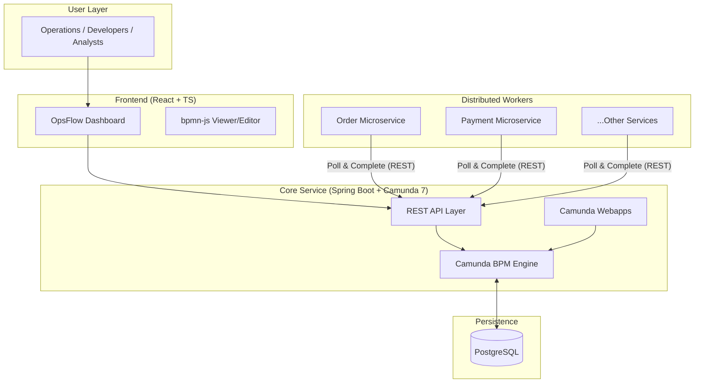
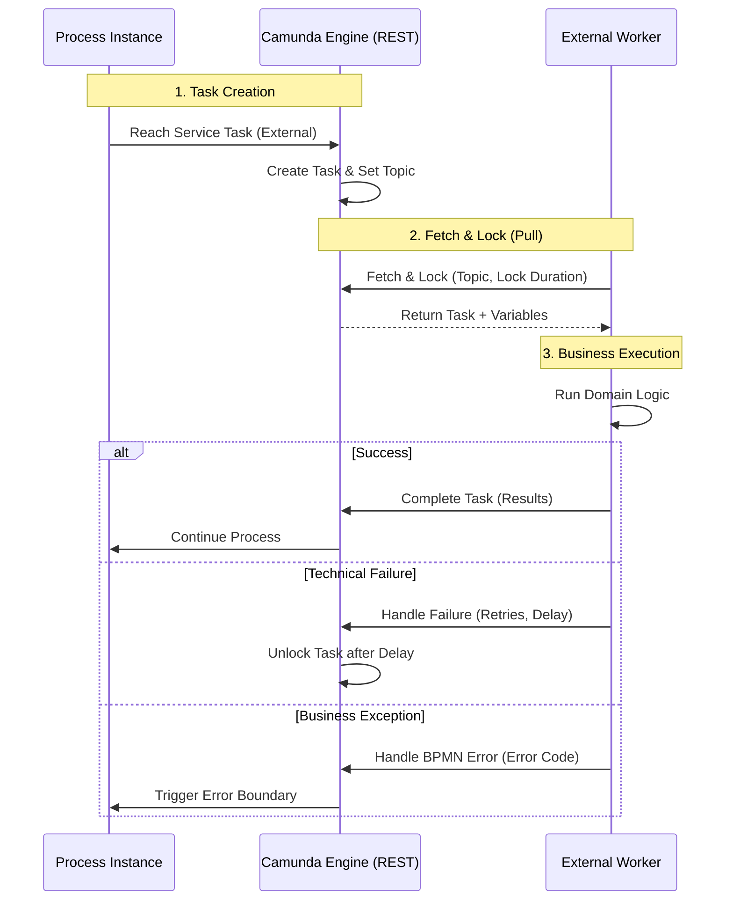

# OpsFlowEngine

[简体中文](./README_zh.md) | English

OpsFlowEngine is a modern, high-performance monitoring and intervention dashboard for Camunda 7.20. It serves as a centralized "Workflow Hub" for microservices, providing real-time visibility and management capabilities for complex business processes.

## 🚀 Overview

OpsFlowEngine is designed for Operations Engineers, Developers, and Business Analysts to manage and monitor Camunda workflows with ease. It provides a single pane of glass for multi-version BPMN models, real-time metrics, and direct instance operations.

## ✨ Key Features

- **Dashboard:** Real-time metrics on active instances, success rates, and failure alerts.
- **Intervention Center:** Detailed execution path visualization (bpmn-js), error diagnostics, and direct instance operations (retry, variables, node jumping).
- **BPMN Library:** Deployment and version management for process definitions.
- **Execution History:** Read-only archive for post-mortem analysis and duration tracking.
- **Audit Logs:** Tamper-evident tracking of all human and system interventions.
- **External Worker Monitoring:** Health tracking and task lock management for distributed microservices.

## 🛠 Tech Stack

### Backend
- **Core Platform:** Java 17, Spring Boot 3.1.5
- **BPMN Engine:** Camunda BPM 7.20.0
- **Persistence:** PostgreSQL
- **Monitoring:** Spring Boot Actuator

### Frontend
- **Framework:** React + TypeScript (Vite)
- **Styling:** Tailwind CSS + Lucide Icons
- **Visualization:** bpmn-js
- **Data Fetching:** React-Query

## 🏗 Architecture

OpsFlowEngine adopts the **Centralized Workflow Hub** architecture using Camunda 7.20.



- **Workflow Server (This Project):** Acts as the orchestration engine, managing process state, history, and the REST API. It does not contain domain-specific business logic.
- **External Workers (Business Microservices):** Distributed services that subscribe to specific "Topics" and execute business logic. This decoupling ensures system resilience and scalability.

### External Task Pattern
1.  **Engine** creates an external task instance when a process reaches a service task marked as `External`.
2.  **Worker** polls the engine for tasks via REST API (long polling).
3.  **Worker** locks and executes the task.
4.  **Worker** reports success/failure back to the engine.



## 🔌 External Task Guidance

To integrate your microservice with OpsFlowEngine, follow these steps:

### 1. Work Model: Fetch & Lock
Unlike traditional Java Delegates that run inside the engine's thread, External Tasks follow a **pull-based** pattern:
- **Topic:** A unique string (e.g., `process-order`) that acts as a "queue" for workers.
- **Locking:** When a worker fetches a task, it "locks" it for a specific duration (e.g., 30s). No other worker can see this task while it is locked.
- **Completion:** The worker must report success (`complete`) or failure (`handleFailure`) before the lock expires. If the lock expires, the task becomes visible to other workers again (automatic retry).

### 2. Key BPMN Properties
When designing your BPMN in Camunda Modeler, configure these for `Service Task`:
- **Implementation:** `External`
- **Topic:** Matches the `@ExternalTaskSubscription` value in your code.
- **Priority (Optional):** Integer value. Higher numbers are fetched first.

### 3. Implementation Deep Dive (Java)
```java
@Configuration
@ExternalTaskSubscription(
    topicName = "process-order",
    lockDuration = 30000,           // Lock for 30s
    variableNames = {"orderId"}     // Only fetch specific variables (optimization)
)
public class OrderWorker implements ExternalTaskHandler {
    @Override
    public void execute(ExternalTask task, ExternalTaskService service) {
        String businessKey = task.getBusinessKey(); // Original ID from process start
        
        try {
            // 1. Get Inputs
            String orderId = (String) task.getVariable("orderId");
            
            // 2. Logic (Ensure Idempotency!)
            boolean success = myBusinessLogic.process(orderId);
            
            // 3. Complete & Pass Back Results
            Map<String, Object> results = Map.of("processedDate", new Date());
            service.complete(task, results);
            
        } catch (BpmnError e) {
            // Business Error: Triggers Error Boundary Event in BPMN
            service.handleBpmnError(task, "ERR_OUT_OF_STOCK", e.getMessage());
            
        } catch (Exception e) {
            // Technical Failure: Triggers Retry
            service.handleFailure(task, 
                "Technical Error", e.getLocalizedMessage(), 
                3,      // Remaining retries
                5000L   // Retry delay (ms)
            );
        }
    }
}
```

### 4. Developer Best Practices
- **Idempotency:** Since tasks can be retried (e.g., due to network timeouts), your business logic must be idempotent to prevent duplicate side effects.
- **Lock Duration:** Set this longer than your maximum expected execution time. If your logic takes 10s, set `lockDuration` to at least 30s.
- **Variable Scoping:** Only fetch the variables you need to reduce network overhead.
- **Business Key:** Use `task.getBusinessKey()` to correlate logs with your external domain entities (e.g., Order ID).

### 5. Advanced Operations: Retry & Skip
OpsFlowEngine provides built-in tools for handling stuck or failed external tasks without code changes:

#### A. Retry Management
- **Automatic Retry:** Managed by the worker code. If `handleFailure` is called with `retries > 0`, the engine will wait for the specified delay and then make the task available for fetching again.
- **Manual Retry (Incident Recovery):** When retries reach 0, an **Incident** is created in Camunda. Use the **Intervention Center** in the UI to "Retry" the task. This calls the backend `setJobRetries` API, which resets the retry count to 1, allowing workers to fetch it again.

#### B. Node Jumping (Skip/Jump)
If an external task cannot be completed (e.g., a downstream system is permanently down), operators can **Skip** the node:
- **How it works:** Uses the **Process Instance Modification API**.
- **Execution:** The engine cancels the current active activity and starts the process at the next node (or any other node in the BPMN).
- **API Example:** `POST /api/workflow/instance/{id}/modification?cancelActivityId=Task_External&startBeforeActivityId=Task_Next`.

## 🚀 Business Microservice Integration Guide

Integrating your microservice with OpsFlowEngine follows the **External Task Pattern**. This ensures your business logic is decoupled from the workflow orchestration.

### 1. Project Initialization
Choose the official Camunda SDK based on your tech stack:
- **Java:** `camunda-external-task-client-spring-boot` (Recommended)
- **Node.js:** `camunda-external-task-client-js`
- **Python:** `camunda-external-task-client-python3`

### 2. Dependency Management (Maven Example)
Add the client to your `pom.xml`:
```xml
<dependency>
    <groupId>org.camunda.bpm</groupId>
    <artifactId>camunda-external-task-client-spring-boot</artifactId>
    <version>7.20.0</version>
</dependency>
```

### 3. Configuration (`application.yml`)
Point your microservice to the OpsFlowEngine endpoint and configure **Basic Auth** (required by default security filters):
```yaml
camunda.bpm.client:
  base-url: http://<ops-flow-host>:8080/engine-rest
  worker-id: order-service-v1
  basic-auth:
    username: ${CAMUNDA_ADMIN_USER:admin}
    password: ${CAMUNDA_ADMIN_PASSWORD:admin}
  subscriptions:
    process-order:
      lock-duration: 30000
```

### 4. Implementing the Worker Lifecycle
A standard worker should handle three scenarios: Success, Technical Failure, and Business Error.

```java
@Component
@ExternalTaskSubscription("process-order")
public class OrderWorker implements ExternalTaskHandler {
    @Override
    public void execute(ExternalTask task, ExternalTaskService service) {
        try {
            // 1. Business Logic
            processOrder(task.getVariable("orderId"));
            
            // 2. Success path
            service.complete(task, Map.of("status", "completed"));
            
        } catch (InsufficientFundsException e) {
            // 3. Business Error path (Triggers BPMN Error Boundary)
            service.handleBpmnError(task, "ERR_FUNDS", e.getMessage());
            
        } catch (Exception e) {
            // 4. Technical Failure path (Triggers Retry)
            service.handleFailure(task, "Connection Timeout", e.getMessage(), 3, 5000L);
        }
    }
}
```

### 5. BPMN Design Checklist
When creating your process in Camunda Modeler:
- [ ] **Type:** Service Task
- [ ] **Implementation:** External
- [ ] **Topic:** `process-order` (Must match code)
- [ ] **Async Before/After:** Recommended for complex flows to ensure state persistence.

### 6. Local Debugging
- Use the **Worker Monitoring** tab in OpsFlow UI to see if your worker is "Online".
- Check the **Incident Center** if your task is stuck due to `retries=0`.

## 📂 Project Structure

```text
.
├── backend/            # Spring Boot + Camunda 7 Engine
├── frontend/           # React + TypeScript Dashboard
├── conductor/          # Project documentation and guidelines
├── docker-compose.yml  # Container orchestration
└── .env.example        # Environment variable template
```

## 🏁 Getting Started

### Prerequisites

- [Docker](https://www.docker.com/) and [Docker Compose](https://docs.docker.com/compose/)
- Java 17+ (for local backend development)
- Node.js 18+ (for local frontend development)

### Quick Start with Docker

1.  **Clone the repository:**
    ```bash
    git clone <repository-url>
    cd camunda_service
    ```

2.  **Configure environment variables:**
    ```bash
    cp .env.example .env
    # Edit .env if necessary
    ```

3.  **Launch the stack:**
    ```bash
    docker-compose up -d --build
    ```

4.  **Access the applications:**
    - **Frontend (UI):** [http://localhost](http://localhost) (port 80)
    - **Backend (Camunda Engine):** [http://localhost:8080](http://localhost:8080)
    - **Camunda Webapps:** [http://localhost:8080/camunda](http://localhost:8080/camunda) (Default Admin: `admin`/`admin`)

### Local Development

#### Backend
```bash
cd backend
./mvnw spring-boot:run
```
*Note: Ensure you have a running PostgreSQL instance as configured in `application.yml`.*

#### Frontend
```bash
cd frontend
npm install
npm run dev
```

## 📖 Documentation

Detailed documentation regarding product requirements, tech stack, and workflows can be found in the `conductor/` directory.

- [Product Definition](conductor/product.md)
- [Technology Stack](conductor/tech-stack.md)
- [Workflow & Style Guides](conductor/workflow.md)

## 🤝 Contributing

Please follow the guidelines established in the `conductor/` folder for all development tasks.

---
*Created with ❤️ by the OpsFlowEngine Team.*
