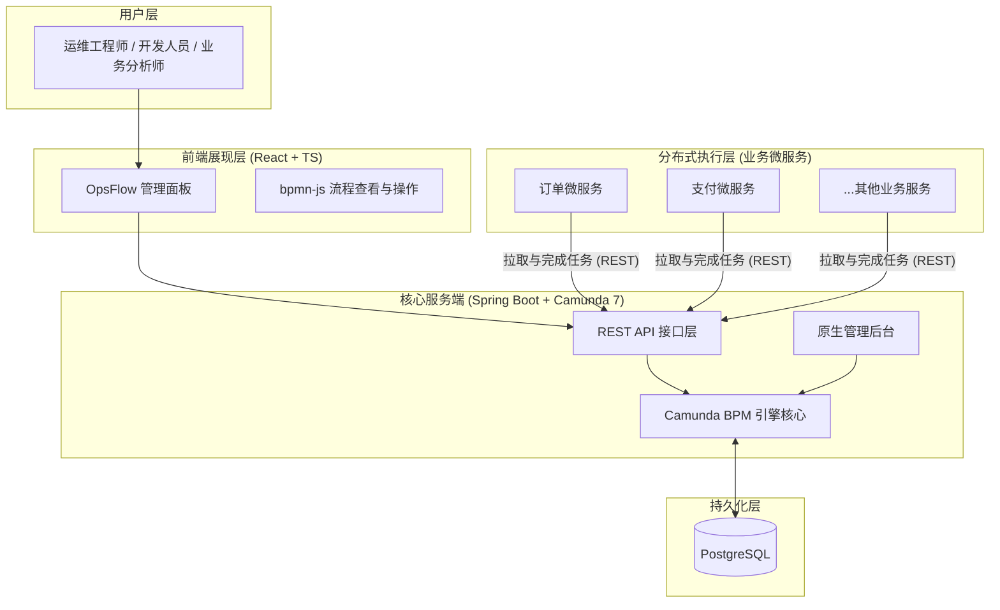
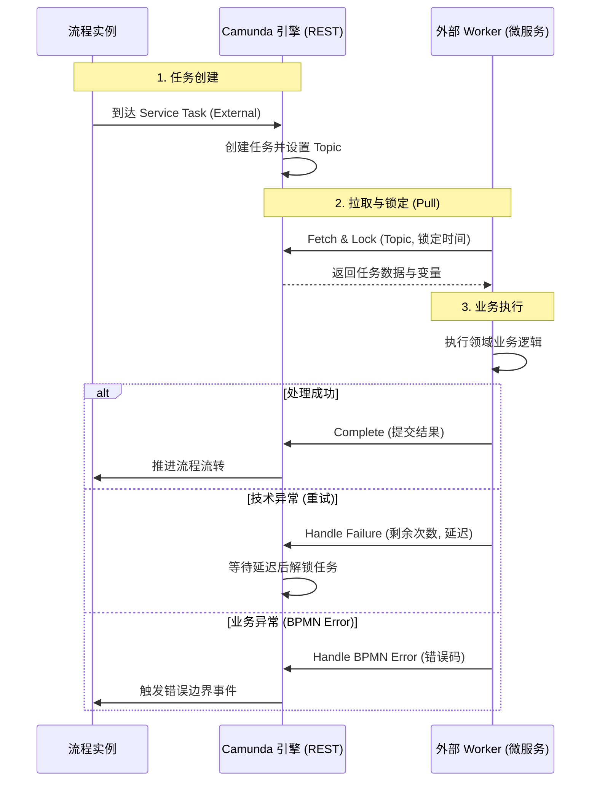

# OpsFlowEngine

OpsFlowEngine 是一个为 Camunda 7.20 设计的现代化、高性能监控与干预面板。它作为微服务的集中式“工作流枢纽”，为复杂的业务流程提供实时可见性和管理能力。

## 🚀 项目概览

OpsFlowEngine 专为运维工程师、开发人员和业务分析师设计，旨在简化 Camunda 工作流的管理。它通过单一界面提供多版本 BPMN 模型、实时指标以及直接的实例操作功能。

## ✨ 核心功能

- **仪表盘 (Dashboard)：** 实时监控活跃实例、成功率和故障告警指标。
- **干预中心 (Intervention Center)：** 详细的执行路径可视化 (bpmn-js)、错误诊断以及直接的实例操作（重试、变量修改、节点跳转）。
- **BPMN 库：** 流程定义的部署与多版本管理。
- **执行历史：** 用于事后分析和时长追踪的只读归档。
- **审计日志：** 对所有人工和系统干预操作进行防篡改追踪。
- **外部任务监控：** 分布式微服务的健康状态追踪与任务锁管理。

## 🛠 技术栈

### 后端
- **核心平台：** Java 17, Spring Boot 3.1.5
- **工作流引擎：** Camunda BPM 7.20.0
- **持久化：** PostgreSQL
- **监控：** Spring Boot Actuator

### 前端
- **框架：** React + TypeScript (Vite)
- **样式：** Tailwind CSS + Lucide Icons
- **可视化：** bpmn-js
- **数据获取：** React-Query

## 🏗 架构设计

OpsFlowEngine 采用 **中心化工作流枢纽 (Centralized Workflow Hub)** 架构，基于 Camunda 7.20 构建。



- **工作流服务端 (本仓库):** 作为编排引擎，负责流程状态管理、历史记录存证以及 REST API 服务。它不包含具体的业务领域逻辑。
- **外部任务执行器 (业务微服务):** 分布式的业务服务通过订阅特定的“主题 (Topic)”来异步领取并执行业务逻辑。这种解耦模式确保了系统的高可用性和弹性伸缩。

### 外部任务 (External Task) 模式
1.  **引擎端:** 当流程到达标记为 `External` 的服务节点时，创建一个外部任务实例。
2.  **Worker 端:** 业务微服务通过 REST API 定时轮询（长轮询）引擎获取任务。
3.  **Worker 端:** 锁定并执行业务逻辑。
4.  **Worker 端:** 向引擎上报成功或失败结果。




## 🔌 外部任务对接深入指南

要将您的业务微服务接入 OpsFlowEngine，请理解以下核心机制：

### 1. 工作模式：拉取与锁定 (Fetch & Lock)
与运行在引擎线程内的传统 Java Delegate 不同，外部任务采用 **基于拉取 (Pull)** 的模式：
- **主题 (Topic):** 一个唯一字符串（如 `process-order`），充当任务“队列”。
- **锁定 (Locking):** 当 Worker 领取任务时，会将其“锁定”一段时间（如 30秒）。在此期间，其他 Worker 无法看到该任务。
- **反馈:** Worker 必须在锁定过期前通过 REST API 上报成功 (`complete`) 或失败 (`handleFailure`)。如果锁定过期，任务将重新变为“可见”，供其他 Worker 领取（实现自动重试）。

### 2. 关键 BPMN 属性
在 Camunda Modeler 中设计 `Service Task` 时，请配置以下项：
- **Implementation (实现方式):** 选择 `External`。
- **Topic (主题):** 必须与代码中 `@ExternalTaskSubscription` 的值完全一致。
- **Priority (优先级):** 整数。数值越大，任务越优先被拉取。

### 3. 代码实现深入示例 (Java)
```java
@Configuration
@ExternalTaskSubscription(
    topicName = "process-order",
    lockDuration = 30000,           // 锁定 30 秒
    variableNames = {"orderId"}     // 优化：仅拉取需要的变量
)
public class OrderWorker implements ExternalTaskHandler {
    @Override
    public void execute(ExternalTask task, ExternalTaskService service) {
        // 获取流程启动时的全局业务标识
        String businessKey = task.getBusinessKey(); 
        
        try {
            // 1. 获取输入参数
            String orderId = (String) task.getVariable("orderId");
            
            // 2. 执行业务逻辑（务必保证幂等性！）
            boolean success = myBusinessLogic.process(orderId);
            
            // 3. 成功：提交结果并结束任务
            Map<String, Object> results = Map.of("processedDate", new Date());
            service.complete(task, results);
            
        } catch (BpmnError e) {
            // 业务异常：触发 BPMN 中的错误边界事件（Error Boundary Event）
            service.handleBpmnError(task, "ERR_OUT_OF_STOCK", e.getMessage());
            
        } catch (Exception e) {
            // 技术异常：触发引擎重试机制
            service.handleFailure(task, 
                "连接超时", e.getLocalizedMessage(), 
                3,      // 剩余重试次数
                5000L   // 下次重试间隔 (ms)
            );
        }
    }
}
```

### 4. 开发人员最佳实践
- **幂等性 (Idempotency):** 由于网络波动或 Worker 宕机可能导致锁定过期，同一个任务可能会被执行多次。业务逻辑必须支持幂等。
- **锁定时长 (Lock Duration):** 必须大于业务处理的最长预期时间。如果处理通常需 10s，建议锁定 30s。
- **变量范围 (Variable Scoping):** 仅拉取必要的变量，以减少网络传输开销。
- **业务关联 (Business Key):** 善用 `task.getBusinessKey()` 将工作流日志与您的业务领域实体（如订单 ID）关联。

### 5. 高级操作：重试与跳过 (Retry & Skip)
OpsFlowEngine 内置了对外部任务故障的处理工具，无需修改业务代码即可实现干预：

#### A. 重试管理 (Retry)
- **自动重试:** 由 Worker 代码逻辑控制。如果调用 `handleFailure` 时 `retries > 0`，引擎将在延迟时间后允许 Worker 再次拉取该任务。
- **人工重试 (故障恢复):** 当重试次数耗尽 (retries=0) 时，Camunda 会创建一个 **Incident (故障实例)**。通过 UI 的“干预中心”，操作员可以点击“重试”按钮。这会调用后端 `setJobRetries` 接口，将重试次数重置为 1，从而使 Worker 能够重新领取该任务。

#### B. 节点跳转 (跳过/回退)
如果某个外部任务由于外部系统永久故障而无法完成，操作员可以选择 **跳过 (Skip)** 该节点：
- **实现原理:** 基于 Camunda 的 **流程实例修改 (Process Instance Modification) API**。
- **执行过程:** 引擎会取消当前处于故障状态的节点，并直接在目标节点（如流程的下一步）启动执行，从而绕过死循环。
- **接口示例:** `POST /api/workflow/instance/{id}/modification?cancelActivityId=Task_External&startBeforeActivityId=Task_Next`。

## 🚀 业务微服务对接指南

将您的微服务接入 OpsFlowEngine 遵循 **外部任务模式 (External Task Pattern)**。这确保了业务逻辑与工作流编排的深度解耦。

### 1. 工程初始化
根据您的技术栈选择官方 SDK：
- **Java:** `camunda-external-task-client-spring-boot` (推荐)
- **Node.js:** `camunda-external-task-client-js`
- **Python:** `camunda-external-task-client-python3`

### 2. 依赖管理 (以 Maven 为例)
在业务服务的 `pom.xml` 中添加客户端 SDK：
```xml
<dependency>
    <groupId>org.camunda.bpm</groupId>
    <artifactId>camunda-external-task-client-spring-boot</artifactId>
    <version>7.20.0</version>
</dependency>
```

### 3. 应用配置 (`application.yml`)
配置微服务连接至 OpsFlowEngine 端点，并开启 **Basic Auth** 认证（本工程安全过滤器默认要求）：
```yaml
camunda.bpm.client:
  base-url: http://<ops-flow-host>:8080/engine-rest
  worker-id: order-service-v1
  basic-auth:
    username: ${CAMUNDA_ADMIN_USER:admin}
    password: ${CAMUNDA_ADMIN_PASSWORD:admin}
  subscriptions:
    process-order:
      lock-duration: 30000
```

### 4. 实现 Worker 生命周期
一个标准的 Worker 应处理三种场景：成功、技术故障、业务错误。

```java
@Component
@ExternalTaskSubscription("process-order")
public class OrderWorker implements ExternalTaskHandler {
    @Override
    public void execute(ExternalTask task, ExternalTaskService service) {
        try {
            // 1. 执行业务逻辑
            processOrder(task.getVariable("orderId"));
            
            // 2. 成功路径：完成任务并提交变量
            service.complete(task, Map.of("status", "completed"));
            
        } catch (InsufficientFundsException e) {
            // 3. 业务错误路径：触发 BPMN 错误边界事件
            service.handleBpmnError(task, "ERR_FUNDS", e.getMessage());
            
        } catch (Exception e) {
            // 4. 技术故障路径：触发引擎重试机制
            service.handleFailure(task, "连接超时", e.getMessage(), 3, 5000L);
        }
    }
}
```

### 5. BPMN 设计自检清单
在 Camunda Modeler 中创建流程时：
- [ ] **节点类型:** Service Task
- [ ] **实现方式:** External
- [ ] **Topic:** `process-order` (必须与代码一致)
- [ ] **异步标记:** 建议开启 Async Before/After 以确保状态持久化。

### 6. 本地调试技巧
- 访问 OpsFlow UI 的 **Worker Monitoring** 标签页，查看您的 Worker 是否显示为 "Online"。
- 如果任务因重试耗尽而卡住，请检查 **Incident Center**。

## 📂 项目结构

```text
.
├── backend/            # Spring Boot + Camunda 7 引擎
├── frontend/           # React + TypeScript 管理面板
├── conductor/          # 项目设计文档与指南
├── docker-compose.yml  # 容器编排配置
└── .env.example        # Environment variable template
```

## 🏁 快速入门

### 环境依赖

- [Docker](https://www.docker.com/) 和 [Docker Compose](https://docs.docker.com/compose/)
- Java 17+ (用于本地后端开发)
- Node.js 18+ (用于本地前端开发)

### 使用 Docker 快速启动

1.  **克隆仓库：**
    ```bash
    git clone <repository-url>
    cd camunda_service
    ```

2.  **配置环境变量：**
    ```bash
    cp .env.example .env
    # 根据实际情况修改 .env
    ```

3.  **启动服务：**
    ```bash
    docker-compose up -d --build
    ```

4.  **访问应用：**
    - **前端界面 (UI):** [http://localhost](http://localhost) (端口 80)
    - **后端接口 (API):** [http://localhost:8080](http://localhost:8080)
    - **Camunda 控制台:** [http://localhost:8080/camunda](http://localhost:8080/camunda) (默认管理员: `admin`/`admin`)

### 本地开发

#### 后端
```bash
cd backend
./mvnw spring-boot:run
```
*注：请确保已按照 `application.yml` 配置并运行 PostgreSQL。*

#### 前端
```bash
cd frontend
npm install
npm run dev
```

## 📖 文档

关于产品定义、技术栈和工作流的详细文档位于 `conductor/` 目录：

- [产品定义 (Product Definition)](conductor/product.md)
- [技术栈 (Technology Stack)](conductor/tech-stack.md)
- [工作流与规范 (Workflow & Style Guides)](conductor/workflow.md)

## 🤝 贡献指南

请在开发过程中遵循 `conductor/` 文件夹中建立的所有规范。

---
*OpsFlowEngine 团队用心打造 ❤️*
